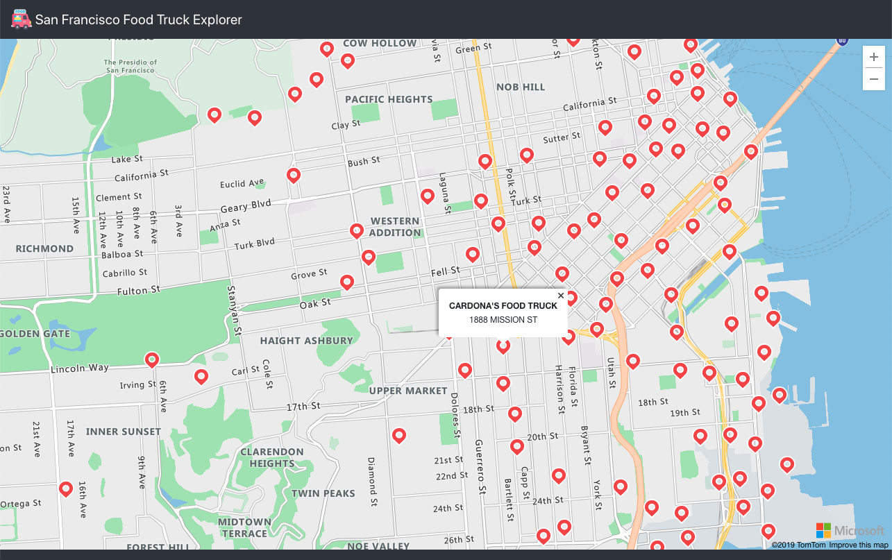

# San Francisco Food Truck Explorer

A prototype application written in TypeScript and React.js to easily visualize in Microsoft Azure Maps all the current active food trucks in the city of San Francisco, CA.




## Technologies Used

-   React.js / create-react-app
-   TypeScript
-   React Bootstrap
-   [React-Azure-Maps](https://www.npmjs.com/package/react-azure-maps)
-   NGINX
-   Docker
-   [SoQL for San Francisco Data API](https://data.sfgov.org/Economy-and-Community/Mobile-Food-Facility-Permit/rqzj-sfat)

## Getting Started

The following instructions will get you up and running in your local environment.

### Prerequisites

-   NPM 6.14+
-   Node 12.16+
-   Azure Maps [Subscription Key](https://docs.microsoft.com/en-us/azure/azure-maps/azure-maps-authentication)

### Installing

#### Clone the repository

```shell
git clone https://github.com/joaquinrdz89/sf-foodtrucks.git && cd sf-foodtrucks
```

#### Install the necessary package dependencies

```shell
npm install
```

#### Create an .env file to store the Azure Maps API Key

```shell
echo "REACT_APP_AZURE_MAP_API_KEY=<YOUR_KEY_GOES_HERE>" >> .env
```

#### Run the application in development mode

```shell
npm start
```

The application will now be ready to be seen at http://localhost:3000

## Creating a Production Build

#### The following command will create an optimized production build in the `./build` folder

```shell
npm run build
```

## Creating a Production Image using Docker

```shell
docker build --build-arg REACT_APP_AZURE_MAP_API_KEY=<YOUR_KEY_GOES_HERE> . -t <repo_name>/<image_name>
```

## Future Enhancements and Ideas

-   Add search functionality
-   Integrate geolocation services to view user's current position
-   Integrate with Yelp API to provide more information about the food trucks (rating, telephone, hours of operation, etc)
-   Filter results
-   Have a datastore available (e.g. MongoDB, Elasticsearch) to store the food trucks data without having to rely on the San Francisco API in case it comes down and also to improve performance

## Other Notes

Coming from a backend development background, this application was an excellent and innovative way to be even more familiarized with some of the React.js capabilities as well as the Azure Cloud Services Catalog.

## Authors

-   **Joaquin Rodriguez** - _Initial work_ - [joaquinrdz89](https://github.com/joaquinrdz89)

## Attributions

-   Icon made by Freepik from www.flaticon.com
